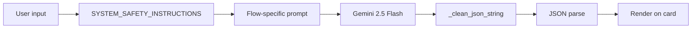

# To run this project
python -m venv .venv
.\.venv\Scripts\Activate.ps1

### 2. Install dependencies

pip install -r requirements.txt

### 3. Add your Gemini API key

use additional key provided in env

```env
GEMINI_API_KEY=your_actual_key_here
```


### 4. Run the app

```powershell
streamlit run main.py
```

The app opens automatically at http://localhost:8501.


---

# About Lumora RecoveryAI

## What it is

Lumora is a small web app I built to help people in addiction recovery get support during their hardest moments. The main idea is simple: when someone is having a craving or a panic spike, they don't have the mental energy to type long messages or navigate menus. They need help in one tap. So Lumora is built around chips, buttons, voice input, and instant AI responses — never long forms.

It runs on Streamlit for the UI and Google Gemini 2.5 Flash for all the AI work.

---

## Why I built it this way

Three things kept coming up when I thought about the problem:

- People in recovery struggle most when their thinking is cloudy — the exact moment when most apps become useless.
- Typing is a barrier. Shaky hands, tears, or 3 A.M. brain fog kill any UX that assumes you can type a sentence.
- Generic advice ("call a friend") is not enough. People need something specific to say, right now.

So every feature is designed to remove one of those friction points.

---

Everything routes through one `GeminiService` wrapper so the safety rules can't be bypassed by mistake.

---

## The GenAI part

I picked Gemini 2.5 Flash because it's fast (usually under 2 seconds), supports voice input directly, and it's good at returning structured JSON when you ask it to. That last part matters a lot — I didn't want the UI breaking because the model decided to wrap its answer in a markdown block one day.

A few things I did to make the AI trustworthy:

- Every request has a **safety system prompt** prepended. It literally says "never diagnose, never shame, always mention 988 if the user is in danger."
- I use `response_mime_type="application/json"` so Gemini has to return valid JSON.
- There's a `_clean_json_string()` fallback that strips markdown fences and extra text just in case.
- I wrote unit tests for the safety prompts. If someone accidentally removes the "988" line, the test suite fails before deploy.



---

## The five features

### 1. Zero-typing check-in

The problem this solves: **"I feel awful but I don't have words."**

You tap a mood chip (`"I want to drink"`, `"I feel exhausted"`, etc.) or you hold the mic and just talk. Gemini reads the input and returns:

- A risk level (Low / Medium / High / Critical)
- A short emotional summary
- The trigger it detected
- Three tiny actions you can do right now
- One line of encouragement

The risk badge uses **both color and a shape symbol** (○ ◐ ◑ ●) so it works even for colorblind users or people looking at their phone in bright sun.

---

### 2. "Need Help Now" button

The problem this solves: **"The urge is here RIGHT NOW."**

One giant button in the header. Tapping it does three things at once:

- Generates a first-person coping script you can read out loud ("this is a wave, I can ride it out")
- Starts a 4-7-8 breathing animation you can sync to
- Drafts a text message you can send to a sponsor or friend in one more tap

The button also fires an aria-live alert so screen readers announce it immediately. Nothing on this page requires typing.

---

### 3. Safety plan generator

The problem this solves: **"I know Fridays are hard. What do I actually do?"**

You pick a trigger (Loneliness, Work Stress, Fatigue, Peer Pressure, or type your own). Gemini gives you a four-part plan:

- Prevention strategy
- Coping techniques
- Things to avoid
- Healthy alternatives

Everything is specific. Not "distract yourself" but "make herbal tea with lime instead of pouring a drink." That specificity is the whole point.

---

### 4. Explain my cravings

The problem this solves: **"Why am I like this? Am I broken?"**

You pick a topic (dopamine reset, why cravings come back, what stress does to the brain) or ask your own question. Gemini explains it in plain language — no clinical jargon, no lectures. The tone reframes shame as biology: *your brain is healing, and every day matters.*

---

### 5. Stress-buster mini-game

The problem this solves: **"I need to interrupt this urge for 60 seconds."**

A little pastel arena. Birds drift across the sky. You catch them with a tap, click, or Space/Enter (keyboard players work too). Every catch shows a sparkle burst and one of several rotating positive messages. There is no losing state — only catches and near-misses. Playing for about a minute is enough to break the craving loop, which is grounded in behavioral therapy research.

---

## UI decisions

I used a pastel palette on purpose. Red-and-black clinical UIs raise heart rate. Rose, lavender, sky, mint, and peach do the opposite. The background gradient shifts slowly and there are drifting sparkle particles — motion that's calming rather than distracting.

Some specific choices:

- **Frosted glass cards** so information feels soft, not boxed in.
- **Purple-to-pink gradient buttons** for primary actions, pastel for secondary. Clear hierarchy without alarm.
- **Breathing widget** pulses on a 19-second cycle matching 4-7-8 rhythm, so trained users can breathe with it directly.
- **Idle 🧍 / running 🏃 status figure** in the header, swapped via CSS `:has()` — a small playful signal that the AI is working.
- **Emergency banner** uses a multi-color pastel gradient instead of red, so it's noticeable without triggering panic.

---

## Accessibility

I aimed for WCAG 2.1 AA. What that looks like in practice:

- Semantic landmarks — `<main>`, `<aside>`, `<section role="region">`, plus a skip-to-content link.
- ARIA live regions on the emergency banner, help confirmation, and game score.
- Risk severity communicated by **shape + color + text**, not color alone.
- Full `prefers-reduced-motion` support — all animations stop for users who want that.
- Every button reachable via Tab, with a visible 3px purple focus ring.
- The mini-game is fully keyboard-playable (Space or Enter catches the bird).
- Decorative emojis marked `aria-hidden="true"` so screen readers don't announce them.
- Hotline numbers are real `tel:` links with descriptive `aria-label`s.

---

## Security and privacy

- All AI-generated content is passed through `html.escape()` before being rendered inside any `unsafe_allow_html` block. That closes the XSS door (OWASP A03).
- No personal data is persisted. `st.session_state` lives in the browser tab and disappears on close.
- No third-party analytics or trackers.
- API key lives in `.env`, is never logged, and is not committed to git.

---

## Testing

There are 32 unit tests covering:

- Safety prompt guardrails (the "988" mention, "never diagnose", "never shame")
- All four Gemini flows with mocked responses
- JSON parsing edge cases (markdown fences, extra text, missing fields)
- Empty input and error branches
- Utility helpers and preset lists
- Accessibility invariants like the risk badge including a shape symbol

Run them with:

```bash
python test_app.py
```

---

## Feature-to-requirement map

| What the problem statement asks for | Where Lumora delivers it |
|---|---|
| Support for substance use disorder | Trauma-informed prompts across every flow |
| Reduce cognitive load in crisis | Zero-typing chips, one-tap Need Help, voice input |
| Multi-modal input | Voice + preset chips + text |
| Real-time risk detection | AI-scored Low / Medium / High / Critical badges |
| Prevention planning | Safety Plan Generator |
| Recovery education | "Explain My Cravings" page |
| Safety guardrails | Prompt-level rules + unit tests |
| Crisis escalation | Mandatory 988 / SAMHSA hotlines + high-risk banner |
| Caregiver involvement | Pre-written caregiver text template |
| Accessibility | WCAG 2.1 AA compliance across the app |

---

## Closing thought

Recovery isn't a straight line. It's a lot of small, terrifying moments where the difference between relapse and resilience is often just how fast someone can feel grounded again. Lumora tries to shrink that response time from minutes of scrolling to one tap — and to treat the user like a human in pain, not a data point in a form.
